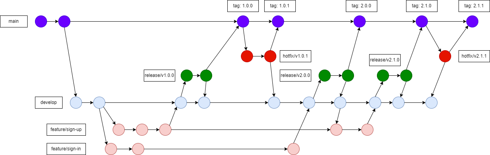

# gitforteams

# Exercise
### Set up a git project for team
    - Development team: 3+ developers, 1 scrum master
    - Operation team: 2 operation
    - Management team: 1 project manager
### Delivery plan
    - 1 Feature Package/2 weeks
    - 1 Patch Package/4 weeks
    - 1 Production Package/3 months
### How do
    - Describe the work your team does
    - Map your network of repositories
    - Diagram your branching strategy
    - Defend what gets stored in the repo
    - Simulate delivery plan
    - Submit your team result: link of repositories, diagrams, team members
### Required Using
    - cherry-pick
    - rebase
    - merge
    - tag
    - branch
    - pull request
    - code review

# Resolve

## Access control
### Strategy: Shared Maintenance
I choose "Shared Maintenance" because I observe that developers work in a branch of the centralized code repository and only the politics of the project prevent them from committing their work to the main body of work.
## Branching pattern
### Pattern: Schedule Release
I choose "Schedule Release" because I observe that We can change it into a release with a scheduled release cycle. Moreover, It combines human-reviews.
## Diagram branching strategy
This is a diagram branching strategy

## Simulate delivery plan
Creating a new branch called the "developer" branch to develop features. When we want to add new features, we will create branches with the corresponding feature, and when the developer finishes the feature, the developer will create a pull request for reviewers reviewer. The reviewers will check and decide merge, rebase, or not. When the feature merged into the developer branch. The project manager will merge the developer branch into the release branch to test everything, and update the documentation. Then, merge the release branch into the main branch and it's will be tagged for the new version. Next, from the main branch, we will detach it into the hotfix branch to fix the error and merge back the main branch and the developer branch to continue to develop another feature.